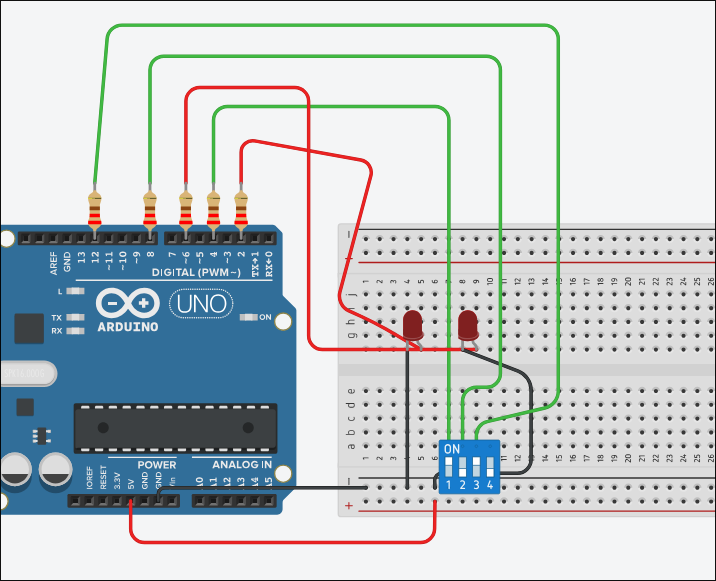
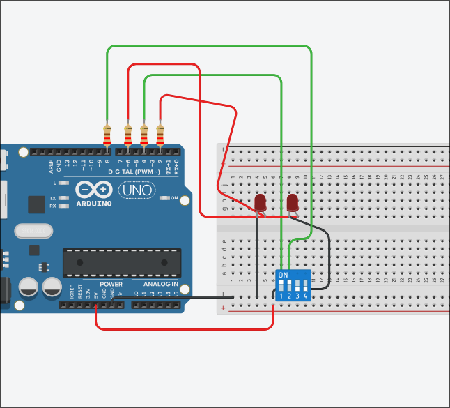
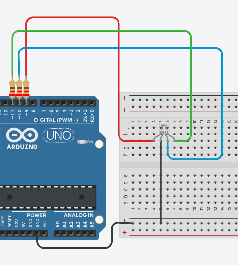
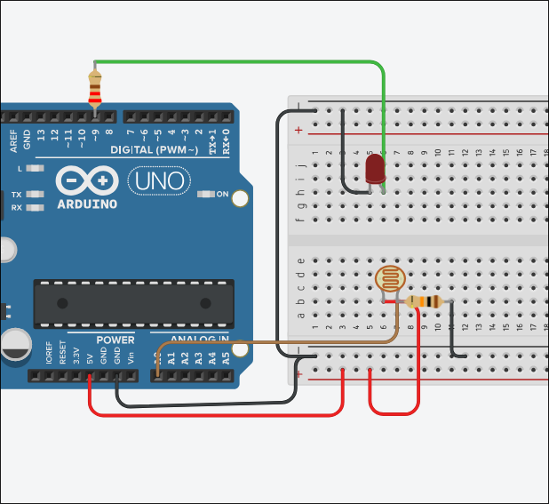

https://www.tinkercad.com/things/2MaFXZX3SLw-thirty

### 1.
**Схема**: Arduino + фоторезистор + светодиод.
**Задача:** При затемнении фоторезистора включить светодиод.
``` C++
const int ldrPin = A0; 
const int ledPin = 9;   

void setup() {
    pinMode(ledPin, OUTPUT);
    Serial.begin(9600);
}

void loop() {
    int lightLevel = analogRead(ldrPin); 
    Serial.println(lightLevel);

    if (lightLevel < 500) { 
        digitalWrite(ledPin, HIGH);
    } else { 
        digitalWrite(ledPin, LOW);
    }
    delay(100);
}

```


### 2
**Схема**: Arduino + фоторезистор + светодиод.
**Задача**: При затемнении фоторезистора **выключить** светодиод.
``` c++
const int ldrPin = A0;     
const int ledPin = 9;

void setup() {
    pinMode(ledPin, OUTPUT);     
    Serial.begin(9600);          
}

void loop() {
    int lightLevel = analogRead(ldrPin);  
    Serial.println(lightLevel);           
  
    if (lightLevel < 500) {               
        digitalWrite(ledPin, LOW);        
    } else {
        digitalWrite(ledPin, HIGH);   
    }

    delay(100);  
}
```


### 3
**Схема**: Arduino + кнопка + светодиод.
**Задача**: При нажатии кнопки включить светодиод.

```C++
const int ledPin = 2;      
const int buttonPin = 4;   

void setup() {
  pinMode(ledPin, OUTPUT);            
  pinMode(buttonPin, INPUT_PULLUP);   
}

void loop() {
  int buttonState = digitalRead(buttonPin);  

  if (buttonState == LOW) {   
    digitalWrite(ledPin, HIGH);  
  } else {
    digitalWrite(ledPin, LOW);   
  }
}

```


### 4

**Схема**: Arduino + кнопка + светодиод.
**Задача**: При нажатии кнопки **выключить** светодиод.

```C++
const int ledPin = 2;      
const int buttonPin = 4;   

void setup() {
  pinMode(ledPin, OUTPUT);            
  pinMode(buttonPin, INPUT_PULLUP);   
}

void loop() {
  int buttonState = digitalRead(buttonPin);  

  if (buttonState == LOW) {   
    digitalWrite(ledPin, LOW);  
  } else {
    digitalWrite(ledPin, HIGH);   
  }
}
```


### 5
**Схема**: Arduino + потенциометр + светодиод.
**Задача**: Изменять яркость светодиода при повороте ручки потенциометра.

```C++
const int potPin = A0;   
const int ledPin = 9;      

void setup() {
  pinMode(ledPin, OUTPUT);  
}

void loop() {
  int potValue = analogRead(potPin);         
  int brightness = map(potValue, 0, 1023, 0, 255);  
  
  analogWrite(ledPin, brightness);            

  delay(10);  
}
```


### 6

**Схема**: Arduino + кнопка + светодиод.
**Задача**: При каждом нажатии кнопки переключать светодиод (вкл/выкл).

```C++
const int ledPin = 2;        
const int buttonPin = 4;    

bool ledState = false;       
bool lastButtonState = HIGH;

void setup() {
  pinMode(ledPin, OUTPUT);
  pinMode(buttonPin, INPUT_PULLUP); 
}

void loop() {
  bool buttonState = digitalRead(buttonPin);  

  
  if (lastButtonState == HIGH && buttonState == LOW) {
    ledState = !ledState;                     
    digitalWrite(ledPin, ledState ? HIGH : LOW); 
    delay(50);  
  }

  lastButtonState = buttonState;  
}
```


### 7
**Схема**: Arduino + кнопка + 2 светодиода.
**Задача**: Реализовать **T-триггер** (переключение между светодиодами по кнопке).

```C++
const int ledPin1 = 2;        
const int ledPin2 = 6;        
const int buttonPin = 4;      

bool state = false;         
bool lastButtonState = HIGH;  

void setup() {
  pinMode(ledPin1, OUTPUT);
  pinMode(ledPin2, OUTPUT);
  pinMode(buttonPin, INPUT_PULLUP);  
}

void loop() {
  bool buttonState = digitalRead(buttonPin);

  if (lastButtonState == HIGH && buttonState == LOW) {
    state = !state;  
    
    
    digitalWrite(ledPin1, state ? HIGH : LOW);
    digitalWrite(ledPin2, state ? LOW : HIGH);

    delay(50); 
  }

  lastButtonState = buttonState;
}
```


### 8
**Схема**: Arduino + кнопка + 2 светодиода.
**Задача**: Поочерёдное включение светодиодов (первый → второй → первый...).

```C++
const int ledPin1 = 2;       
const int ledPin2 = 6;        
const int buttonPin = 4;      

bool isFirstOn = true;       
bool lastButtonState = HIGH;  

void setup() {
  pinMode(ledPin1, OUTPUT);
  pinMode(ledPin2, OUTPUT);
  pinMode(buttonPin, INPUT_PULLUP);  
}

void loop() {
  bool buttonState = digitalRead(buttonPin);

  if (lastButtonState == HIGH && buttonState == LOW) {
    isFirstOn = !isFirstOn;  

    if (isFirstOn) {
      digitalWrite(ledPin1, HIGH);
      digitalWrite(ledPin2, LOW);
    } else {
      digitalWrite(ledPin1, LOW);
      digitalWrite(ledPin2, HIGH);
    }

    delay(50);  
  }

  lastButtonState = buttonState;
}

```


### 9

**Схема**: Arduino + 2 кнопки + 2 светодиода.
**Задача**: **RS-триггер** (кнопка 1 — включить LED1, кнопка 2 — включить LED2).

```C++
const int ledPin1 = 2;        
const int ledPin2 = 6;        
const int buttonPin1 = 4;     
const int buttonPin2 = 8;     

bool state = false;           
bool lastButton1 = HIGH;
bool lastButton2 = HIGH;

void setup() {
  pinMode(ledPin1, OUTPUT);
  pinMode(ledPin2, OUTPUT);
  
  pinMode(buttonPin1, INPUT_PULLUP);  
  pinMode(buttonPin2, INPUT_PULLUP); 
}

void loop() {
  bool button1 = digitalRead(buttonPin1);
  bool button2 = digitalRead(buttonPin2);

 
  if (lastButton1 == HIGH && button1 == LOW) {
    state = true;   
    delay(50);      
  }
 if (lastButton2 == HIGH && button2 == LOW) {
    state = false;  
    delay(50);     
  }

  if (state) {
    digitalWrite(ledPin1, HIGH);
    digitalWrite(ledPin2, LOW);
  } else {
    digitalWrite(ledPin1, LOW);
    digitalWrite(ledPin2, HIGH);
  }

  lastButton1 = button1;  
  lastButton2 = button2;
}

```

![]2025-05-29-122310_hyprshot.png)

### 10
**Схема**: Arduino + 3 кнопки + 2 светодиода.
**Задача**: **JK-триггер** (комбинации кнопок меняют состояние светодиодов).

```C++
const int ledPin1 = 2;        
const int ledPin2 = 6;       
const int leverJ = 4;    
const int leverK = 8;     
const int clockPin = 12;     

bool state = false;    

void setup() {
  pinMode(ledPin1, OUTPUT);
  pinMode(ledPin2, OUTPUT);

  pinMode(leverJ, INPUT_PULLUP);  
  pinMode(leverK, INPUT_PULLUP);  
  pinMode(clockPin, INPUT_PULLUP);
}

void loop() {
  bool j = digitalRead(leverJ) == LOW;  
  bool k = digitalRead(leverK) == LOW;
  bool clock = digitalRead(clockPin);

  
  if (!j && !k) {
   
  } else if (!j && k) {
    state = false; 
  } else if (j && !k) {
    state = true; 
  } else if (j && k) {
    state = !state;  
    
  }

 
  digitalWrite(ledPin1, state ? HIGH : LOW);
  digitalWrite(ledPin2, state ? LOW : HIGH);
}


```



### 11.
**Схема**: Arduino + 2 кнопки + 2 светодиода.
**Задача**: **D-триггер** (кнопка 1 — данные, кнопка 2 — такт).

```C++
const int ledPin1 = 2;        
const int ledPin2 = 6;        
const int dataPin = 4;        
const int clockPin = 8;       

bool state = false;           
bool prevClock = HIGH;         

void setup() {
  pinMode(ledPin1, OUTPUT);
  pinMode(ledPin2, OUTPUT);
  
  pinMode(dataPin, INPUT_PULLUP);     
  pinMode(clockPin, INPUT_PULLUP);   
}

void loop() {
  bool d = digitalRead(dataPin) == LOW;      
  bool currentClock = digitalRead(clockPin);  
  
 
  if (prevClock == HIGH && currentClock == LOW) {
    state = d;  
  }
  prevClock = currentClock;  
  
  digitalWrite(ledPin1, state ? HIGH : LOW);
  digitalWrite(ledPin2, state ? LOW : HIGH);
}
```


### 12

**Схема**: Arduino + 3 светодиода.
**Задача**: «Бегущий огонь» (последовательное включение).

```C++
const int ledPins[] = {2, 4, 6};  
const int numLeds = 3;            
const int delayTime = 300; 

void setup() {
  for (int i = 0; i < numLeds; i++) {
    pinMode(ledPins[i], OUTPUT);
    digitalWrite(ledPins[i], LOW);
  }
}

void loop() {
  
  for (int i = 0; i < numLeds; i++) {

    for (int j = 0; j < numLeds; j++) {
      digitalWrite(ledPins[j], LOW);
    }
    digitalWrite(ledPins[i], HIGH);
    delay(delayTime);
  }

  for (int i = numLeds - 2; i > 0; i--) {
    
    for (int j = 0; j < numLeds; j++) {
      digitalWrite(ledPins[j], LOW);
    }

    digitalWrite(ledPins[i], HIGH);
    delay(delayTime);
  }
}
```


### 13 
**Схема**: Arduino + 4 светодиода.
**Задача**: Последовательное включение **двух** светодиодов.
```C++
const int ledPins[] = {2, 4, 6, 8};
const int numLeds = 4;
const int delayTime = 300;

void setup() {
  for (int i = 0; i < numLeds; i++) {
    pinMode(ledPins[i], OUTPUT);
  }
}

void loop() {

  for (int i = 0; i <= numLeds - 2; i++) {
    digitalWrite(ledPins[i], HIGH);
    digitalWrite(ledPins[i+1], HIGH);
    delay(delayTime);
    digitalWrite(ledPins[i], LOW);
  }
  

  for (int i = numLeds - 1; i >= 1; i--) {
    digitalWrite(ledPins[i], HIGH);
    digitalWrite(ledPins[i-1], HIGH);
    delay(delayTime);
    digitalWrite(ledPins[i], LOW);
  }
}
```


### 14

**Схема**: Arduino + 4 светодиода.
**Задача**: «Накапливающееся включение» (1 → 1+2 → 1+2+3 → 1+2+3+4).

```C++
const int ledPins[] = {2, 4, 6, 8};  
const int numLeds = 4;               
const int delayTime = 500;           

void setup() {

  for (int i = 0; i < numLeds; i++) {
    pinMode(ledPins[i], OUTPUT);
    digitalWrite(ledPins[i], LOW);   
  }
}

void loop() {

  for (int i = 0; i < numLeds; i++) {
    digitalWrite(ledPins[i], HIGH); 
    delay(delayTime);                
  }


  for (int i = 0; i < numLeds; i++) {
    digitalWrite(ledPins[i], LOW);   
  }
  delay(delayTime);                  
}
```


### 15

**Схема**: Arduino + 4 светодиода.
**Задача**: «Обратное выключение» (4 → 4+3 → 4+3+2 → 4+3+2+1).

```C++
const int ledPins[] = {2, 4, 6, 8};  
const int numLeds = 4;               
const int delayTime = 500;           

void setup() {
  
  for (int i = 0; i < numLeds; i++) {
    pinMode(ledPins[i], OUTPUT);
    digitalWrite(ledPins[i], HIGH);  
  }
}

void loop() {
  
  for (int i = 0; i < numLeds; i++) {
    digitalWrite(ledPins[numLeds-1 - i], LOW);  
    delay(delayTime);                           
  }

  
  for (int i = 0; i < numLeds; i++) {
    digitalWrite(ledPins[i], HIGH);  
  }
  delay(delayTime);                  
}
```


### 16

**Схема**: Arduino + RGB-светодиод
**Задача**: Плавное переключение цветов RGB-светодиода

```C++
const int redPin = 9;     

const int greenPin = 10;  

const int bluePin = 11;   

int redVal = 0;
int greenVal = 0;
int blueVal = 0;

int fadeSpeed = 10;  

int brightness = 150;      

void setup() {
  pinMode(redPin, OUTPUT);
  pinMode(greenPin, OUTPUT);
  pinMode(bluePin, OUTPUT);
}

void setColor(int r, int g, int b) {
  analogWrite(redPin, r);
  analogWrite(greenPin, g);
  analogWrite(bluePin, b);
}

void loop() {
  
  for (int i = 0; i <= brightness; i++) {
    redVal = brightness - i;
    greenVal = i;
    setColor(redVal, greenVal, 0);
    delay(fadeSpeed);
  }

  
  for (int i = 0; i <= brightness; i++) {
    greenVal = brightness - i;
    blueVal = i;
    setColor(0, greenVal, blueVal);
    delay(fadeSpeed);
  }

  
  for (int i = 0; i <= brightness; i++) {
    blueVal = brightness - i;
    redVal = i;
    setColor(redVal, 0, blueVal);
    delay(fadeSpeed);
  }
}
```


### 17

**Схема**: Arduino + RGB-светодиод
**Задача**: Переключение между конкретными цветами (красный → оранжевый → желтый → зеленый → синий → фиолетовый)

```C++
const int rgbPins[3] = {9, 10, 11}; 

const byte colorSequence[6][3] = {
  {255, 0, 0},     
  {255, 70, 0},    
  {255, 150, 0},  
  {0, 255, 0},    
  {0, 0, 255},    
  {128, 0, 255}    
};

const int delayBetweenColors = 2000;  

void setup() {
  for (int i = 0; i < 3; i++) {
    pinMode(rgbPins[i], OUTPUT);
  }
}

void setColor(byte r, byte g, byte b) {
  analogWrite(rgbPins[0], r);
  analogWrite(rgbPins[1], g);
  analogWrite(rgbPins[2], b);
}

void loop() {
  for (int i = 0; i < 6; i++) {
    setColor(colorSequence[i][0], colorSequence[i][1], colorSequence[i][2]);
    delay(delayBetweenColors);
  }
}
```


### 18

**Схема**: Arduino + 3 потенциометра + RGB-светодиод
**Задача**: Управление цветом RGB-светодиода с помощью трех потенциометров

```C++
const int potPins[3] = {A0, A1, A2}; 
const int ledPins[3] = {9, 10, 11}; 

int currentValues[3] = {0, 0, 0};     
int targetValues[3] = {0, 0, 0};      
const int fadeSpeed = 5;              

void setup() {
  for (int i = 0; i < 3; i++) {
    pinMode(ledPins[i], OUTPUT);
  }
  Serial.begin(9600);
}

void loop() {

  for (int i = 0; i < 3; i++) {
    targetValues[i] = map(analogRead(potPins[i]), 0, 1023, 0, 255);
  }
  

  for (int i = 0; i < 3; i++) {
    if (currentValues[i] < targetValues[i]) {
      currentValues[i] += fadeSpeed;
      if (currentValues[i] > targetValues[i]) currentValues[i] = targetValues[i];
    } 
    else if (currentValues[i] > targetValues[i]) {
      currentValues[i] -= fadeSpeed;
      if (currentValues[i] < targetValues[i]) currentValues[i] = targetValues[i];
    }
    analogWrite(ledPins[i], currentValues[i]);
  }
  

  delay(20);
}
```


### 19

**Схема**: Arduino + 3 кнопки + RGB-светодиод
**Задача**: Каждая кнопка включает свой цвет (красный, зеленый, синий)

```C++

const int buttonRed = 2;
const int buttonGreen = 3;
const int buttonBlue = 4;


const int ledRed = 9;    
const int ledGreen = 10; 
const int ledBlue = 11;  


int activeColor = 0;
const int brightness = 200; 

void setup() {

  pinMode(buttonRed, INPUT_PULLUP);
  pinMode(buttonGreen, INPUT_PULLUP);
  pinMode(buttonBlue, INPUT_PULLUP);
  

  pinMode(ledRed, OUTPUT);
  pinMode(ledGreen, OUTPUT);
  pinMode(ledBlue, OUTPUT);
  
  
  resetLeds();
}

void loop() {

  if (digitalRead(buttonRed) == LOW) {
    delay(50); 
    if (digitalRead(buttonRed) == LOW) {
      setColor(1); 
    }
  }
  else if (digitalRead(buttonGreen) == LOW) {
    delay(50);
    if (digitalRead(buttonGreen) == LOW) {
      setColor(2); 
    }
  }
  else if (digitalRead(buttonBlue) == LOW) {
    delay(50);
    if (digitalRead(buttonBlue) == LOW) {
      setColor(3); 
    }
  }
}


void setColor(int color) {
  resetLeds(); 
  
  switch(color) {
    case 1: 
      analogWrite(ledRed, brightness);
      break;
    case 2: 
      analogWrite(ledGreen, brightness);
      break;
    case 3: 
      analogWrite(ledBlue, brightness);
      break;
    default: 
      resetLeds();
  }
  activeColor = color;
}


void resetLeds() {
  analogWrite(ledRed, 0);
  analogWrite(ledGreen, 0);
  analogWrite(ledBlue, 0);
}
```


### 20
**Схема**: Arduino + RGB-светодиод  
**Задача**: Плавное переключение цветов (аналогично билету 16)

```C++
const int pins[3] = {9, 10, 11};
int values[3] = {255, 0, 0}; 
const int fadeSpeed = 1;

void setup() {
  for (int i = 0; i < 3; i++) {
    pinMode(pins[i], OUTPUT);
  }
}

void loop() {
  for (int i = 0; i < 3; i++) {
    int next = (i + 1) % 3;
    while (values[i] > 0 || values[next] < 255) {
      if (values[i] > 0) values[i] -= fadeSpeed;
      if (values[next] < 255) values[next] += fadeSpeed;
      
      for (int j = 0; j < 3; j++) {
        analogWrite(pins[j], values[j]);
      }
      delay(20);
    }
  }
}
```


### 21

**Схема**: Arduino + кнопка + светодиод  
**Задача**: При нажатии кнопки выключить светодиод

```C++
const int buttonPin = 2; 
const int ledPin = 4;     

void setup() {
  pinMode(buttonPin, INPUT_PULLUP); 
  pinMode(ledPin, OUTPUT);
  digitalWrite(ledPin, HIGH); 
}

void loop() {
  if (digitalRead(buttonPin) == LOW) { 
    digitalWrite(ledPin, LOW); 
  } else {
    digitalWrite(ledPin, HIGH); 
  }
}
```


### 22

**Схема**: Arduino + кнопка + светодиод  
**Задача**: Переключать светодиод при каждом нажатии кнопки

```C++
const int buttonPin = 2;  
const int ledPin = 4;     
bool ledState = false;    
bool lastButtonState = HIGH; 
unsigned long lastDebounceTime = 0;
const unsigned long debounceDelay = 50; 

void setup() {
  pinMode(buttonPin, INPUT_PULLUP); 
  pinMode(ledPin, OUTPUT);
  digitalWrite(ledPin, ledState ? HIGH : LOW); 
}

void loop() {
  int reading = digitalRead(buttonPin);

  
  if (reading != lastButtonState) {
    lastDebounceTime = millis();
  }

  if ((millis() - lastDebounceTime) > debounceDelay) {
    if (reading == LOW) { 
      ledState = !ledState; 
      digitalWrite(ledPin, ledState ? HIGH : LOW);
      delay(200); 
    }
  }

  lastButtonState = reading;
}

```


### 23
**Схема**: Arduino + фоторезистор + светодиод  
**Задача**: При затемнении включить светодиод

```C++
const int ldrPin = A0; 
const int ledPin = 9;   

void setup() {
    pinMode(ledPin, OUTPUT);
    Serial.begin(9600);
}

void loop() {
    int lightLevel = analogRead(ldrPin); 
    Serial.println(lightLevel);

    if (lightLevel < 500) { 
        digitalWrite(ledPin, HIGH);
    } else { 
        digitalWrite(ledPin, LOW);
    }
    delay(100);
}
```



### 24

**Схема**: Arduino + 3 кнопки + RGB-светодиод  
**Задача**: Каждая кнопка включает свой цвет

```C++

const int buttonRed = 2;
const int buttonGreen = 3;
const int buttonBlue = 4;


const int ledRed = 9;    
const int ledGreen = 10; 
const int ledBlue = 11;  


int activeColor = 0;
const int brightness = 200; 

void setup() {

  pinMode(buttonRed, INPUT_PULLUP);
  pinMode(buttonGreen, INPUT_PULLUP);
  pinMode(buttonBlue, INPUT_PULLUP);
  

  pinMode(ledRed, OUTPUT);
  pinMode(ledGreen, OUTPUT);
  pinMode(ledBlue, OUTPUT);
  
  
  resetLeds();
}

void loop() {

  if (digitalRead(buttonRed) == LOW) {
    delay(50); 
    if (digitalRead(buttonRed) == LOW) {
      setColor(1); 
    }
  }
  else if (digitalRead(buttonGreen) == LOW) {
    delay(50);
    if (digitalRead(buttonGreen) == LOW) {
      setColor(2); 
    }
  }
  else if (digitalRead(buttonBlue) == LOW) {
    delay(50);
    if (digitalRead(buttonBlue) == LOW) {
      setColor(3); 
    }
  }
}


void setColor(int color) {
  resetLeds(); 
  
  switch(color) {
    case 1: 
      analogWrite(ledRed, brightness);
      break;
    case 2: 
      analogWrite(ledGreen, brightness);
      break;
    case 3: 
      analogWrite(ledBlue, brightness);
      break;
    default: 
      resetLeds();
  }
  activeColor = color;
}


void resetLeds() {
  analogWrite(ledRed, 0);
  analogWrite(ledGreen, 0);
  analogWrite(ledBlue, 0);
}
```


### 25

**Схема**: Arduino + 3 потенциометра + RGB-светодиод  
**Задача**: Управление цветом с помощью потенциометров

```C++
const int potPins[3] = {A0, A1, A2}; 
const int ledPins[3] = {9, 10, 11}; 

int currentValues[3] = {0, 0, 0};     
int targetValues[3] = {0, 0, 0};      
const int fadeSpeed = 5;              

void setup() {
  for (int i = 0; i < 3; i++) {
    pinMode(ledPins[i], OUTPUT);
  }
  Serial.begin(9600);
}

void loop() {

  for (int i = 0; i < 3; i++) {
    targetValues[i] = map(analogRead(potPins[i]), 0, 1023, 0, 255);
  }
  

  for (int i = 0; i < 3; i++) {
    if (currentValues[i] < targetValues[i]) {
      currentValues[i] += fadeSpeed;
      if (currentValues[i] > targetValues[i]) currentValues[i] = targetValues[i];
    } 
    else if (currentValues[i] > targetValues[i]) {
      currentValues[i] -= fadeSpeed;
      if (currentValues[i] < targetValues[i]) currentValues[i] = targetValues[i];
    }
    analogWrite(ledPins[i], currentValues[i]);
  }
  

  delay(20);
}
```


### 26

**Схема**: Arduino + фоторезистор + светодиод  
**Задача**: При затемнении выключить светодиод

```C++
const int ldrPin = A0;     
const int ledPin = 9;

void setup() {
    pinMode(ledPin, OUTPUT);     
    Serial.begin(9600);          
}

void loop() {
    int lightLevel = analogRead(ldrPin);  
    Serial.println(lightLevel);           
  
    if (lightLevel < 500) {               
        digitalWrite(ledPin, LOW);        
    } else {
        digitalWrite(ledPin, HIGH);   
    }

    delay(100);  
}
```


### 27

**Схема**: Arduino + 3 светодиода  
**Задача**: "Бегущий огонь"

```C++
const int ledPins[] = {2, 4, 6};  
const int numLeds = 3;            
const int delayTime = 300; 

void setup() {
  for (int i = 0; i < numLeds; i++) {
    pinMode(ledPins[i], OUTPUT);
    digitalWrite(ledPins[i], LOW);
  }
}

void loop() {
  
  for (int i = 0; i < numLeds; i++) {

    for (int j = 0; j < numLeds; j++) {
      digitalWrite(ledPins[j], LOW);
    }
    digitalWrite(ledPins[i], HIGH);
    delay(delayTime);
  }

  for (int i = numLeds - 2; i > 0; i--) {
    
    for (int j = 0; j < numLeds; j++) {
      digitalWrite(ledPins[j], LOW);
    }

    digitalWrite(ledPins[i], HIGH);
    delay(delayTime);
  }
}
```


### 28

**Схема**: Arduino + потенциометр + светодиод  
**Задача**: Управление яркостью светодиода

```C++
const int potPin = A0;   
const int ledPin = 9;      

void setup() {
  pinMode(ledPin, OUTPUT);  
}

void loop() {
  int potValue = analogRead(potPin);         
  int brightness = map(potValue, 0, 1023, 0, 255);  
  
  analogWrite(ledPin, brightness);            

  delay(10);  
}
```


### 29

**Схема**: Arduino + RGB-светодиод  
**Задача**: Переключение между конкретными цветами

```C++
const int rgbPins[3] = {9, 10, 11}; 

const byte colorSequence[6][3] = {
  {255, 0, 0},     
  {255, 70, 0},    
  {255, 150, 0},  
  {0, 255, 0},    
  {0, 0, 255},    
  {128, 0, 255}    
};

const int delayBetweenColors = 2000;  

void setup() {
  for (int i = 0; i < 3; i++) {
    pinMode(rgbPins[i], OUTPUT);
  }
}

void setColor(byte r, byte g, byte b) {
  analogWrite(rgbPins[0], r);
  analogWrite(rgbPins[1], g);
  analogWrite(rgbPins[2], b);
}

void loop() {
  for (int i = 0; i < 6; i++) {
    setColor(colorSequence[i][0], colorSequence[i][1], colorSequence[i][2]);
    delay(delayBetweenColors);
  }
}
```


### 30

**Схема**: Arduino + кнопка + светодиод  
**Задача**: При нажатии включить светодиод

```C++
const int ledPin = 2;      
const int buttonPin = 4;   

void setup() {
  pinMode(ledPin, OUTPUT);            
  pinMode(buttonPin, INPUT_PULLUP);   
}

void loop() {
  int buttonState = digitalRead(buttonPin);  

  if (buttonState == LOW) {   
    digitalWrite(ledPin, HIGH);  
  } else {
    digitalWrite(ledPin, LOW);   
  }
}
```

